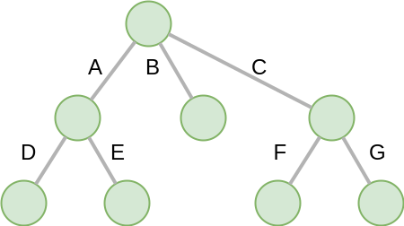
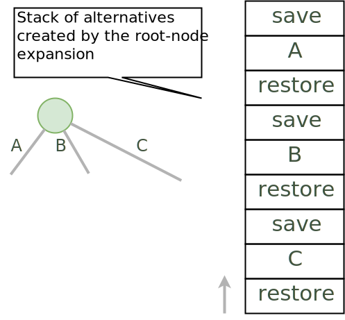

*****************************************************************
Part 3: State Management (Trail + Copy) and Search
*****************************************************************

*We ask you not to publish your solutions on a public repository.
The instructors interested to get the source code of
our solutions can contact us.*

Slides
======

* `Lectures on Youtube <https://youtube.com/playlist?list=PLq6RpCDkJMypASwwjt0XfPW0j27guprFT>`_
* `State Management <https://www.icloud.com/keynote/0cf8N6xHD-b3oQ6zRt8w538oQ#03-state-management-search>`_

Theoretical Questions
=====================

* `State Managers <https://inginious.org/course/minicp/statemanager>`_

DFS Explicit Stack
===================

The search algorithm of MiniCP is *depth-first-search*.
It is implemented using a recursive method in the class
`DFSearch.java <https://github.com/minicp/minicp/blob/master/src/main/java/minicp/search/DFSearch.java>`_.
To avoid `stack-overflow` exceptions due to a too deep recursion in Java
we ask you to reimplement the depth-first search with an explicit stack
instead of relying on the recursion-call stack.

Consider the following search tree where branches to execute are represented as letters:

A DFS exploration should execute the above branches in the following sequence `A, D, E, B, C, F, G`, where executing a branch 
means:
1. performing the variable and value selection associated with the branch (most often fixing a variable to a value, or removing the value from the domain of a variable)
2. propagating all constraints until fix-point is reached.

When backtracking, the previous state must be restored, requiring that the state is saved with the
`save` operation before the branch is executed and restored with the `restore` operation when the branch finishes terminating.
The `save` operation is executed in pre-order fashion while the `restore` operation is executed in a post-order fashion.

For example; given the figure above, a valid sequence that successfully saves and restores the state when backtracking is:
`save⮕A⮕save⮕D⮕restore⮕save⮕E⮕restore⮕restore⮕save⮕B⮕restore⮕save⮕C⮕save⮕F⮕restore⮕save⮕G⮕restore⮕restore`.

Note that the state manager performs a `save` operation prior to searching (before any branching is performed) and a `restore` operation after search
concludes. 
The following code snippet shows a recursive implementation. Note that the saving and restoring of states is performed
in the method `withNewState` of the state manager `sm`:

.. code-block:: java

    private void dfs(SearchStatistics statistics, Predicate<SearchStatistics> limit, int parentId, int position) {
        if (limit.test(statistics))
            throw new StopSearchException();
        Procedure[] branches = branching.get();
        final int nodeId = currNodeIdId++;

        if (branches.length == 0) {
            statistics.incrSolutions();
            notifySolution(parentId,nodeId, position);
        } else {
            notifyBranch(parentId,nodeId, position, branches.length);
            int pos = 0;
            for (Procedure b : branches) {
                final int p = pos;
                sm.withNewState(() -> {
                    try {
                        statistics.incrNodes();
                        b.call();
                        dfs(statistics, limit, nodeId, p);
                    } catch (InconsistencyException e) {
                        currNodeIdId++;
                        statistics.incrFailures();
                        notifyFailure(parentId,nodeId, p);
                    }
                });
                pos += 1;
            }
        }
    }

Skeleton code is given below. However, there are many possible implementations, so feel free to not use the skeleton code.

.. code-block:: java
   :emphasize-lines: 6

   private void dfs(SearchStatistics statistics, Predicate<SearchStatistics> limit, int parentId, int position) {
       if (limit.test(statistics))
           throw new StopSearchException();
       Stack<Procedure> alternatives = new Stack<Procedure>();
       sm.withNewState(() -> {
           expandNode(alternatives, statistics, parentId, position); // root expansion
           while (!alternatives.isEmpty()) {
               if (limit.test(statistics)) {
                   throw new StopSearchException();
               }
               alternatives.pop().call();
           }
       });
   }

   private void expandNode(Stack<Procedure> alternatives, SearchStatistics statistics, int parentId, int position) {
       // TODO
   }

The idea of this solution is to wrap the save, restore, and branch executions inside `Alternative` closure objects,
as illustrated on the next figure showing the stack after the root node expansion at line 3.

Note that each branch procedure must be wrapped inside a closure that catches any `InconsistencyException` thrown.
If such an exception is caught, then the number of failures is to be increased,
the failure is to be notified, and no sub-branches of the corresponding branch are to be expanded. 

Verify that your implementation passes the tests of `DFSearchTest.java <https://github.com/minicp/minicp/blob/master/src/test/java/minicp/search/DFSearchTest.java>`_.

Remark (optional): It is possible to reduce the number of operations by skipping the save and restore
operations for the for the last branch of any node (the branches B, C, E, and G in the
example above).
The sequence of operations becomes `save⮕A⮕save⮕D⮕restore⮕E⮕restore⮕save⮕B⮕restore⮕C⮕save⮕F⮕restore⮕G`.
As stated above, the state manager will perform a save operation before the search starts and a restore operation once the search 
concludes.

Implement a Custom Search
=================================

For the Quadratic Assignment Problem (see the slides on the Element
constraint of :ref:`Part 4: Sum and Element Constraints`), modify the model `QAP.java
<https://github.com/minicp/minicp/blob/master/src/main/java/minicp/examples/QAP.java>`_,
where variable `x[i]` denotes the location of facility `i`,
in order to implement a custom search strategy (and ignore the
instructions on discrepancy search).

Here follows some skeleton code for a custom search heuristic of the quadratic assignment problem:

.. code-block:: java

        DFSearch dfs = makeDfs(cp, () -> {
            IntVar sel = selectMin(x,
                    vari -> vari.size() > 1, // filter
                    vari -> vari.size()      // variable selector
            );
            if (sel == null)
                return EMPTY;
            int v = sel.min(); // value selector (TODO)
            return branch(
                () -> cp.post(equal(sel,v)),
                () -> cp.post(notEqual(sel,v))
            );
        });

To do:

1. Find a pair of integers `i` and `j` (representing facilities `i` and `j`), with `i != j`, where `x[i]` is unfixed (a facility not yet assigned to a location) and `x[j]` is fixed or unfixed, that has maximum weight `w[i][j]`.
2. Find a pair of integers `k` and `l` (representing the locations of facilities `i` and `j` respectively), with minimum distance `distances[k][l]`.

* As a variable selection heuristic, select facility `x[i]`.
* As a value selection heuristic, select location `k`.
* On the first branch, fix `x[i]` to `k` and on the second branch, remove the value `k` from the domain of `x[i]`.

**Hint**: `selectMin` is a generic method parameterized by 'T' and 'N' (the type on which the minimum is computed). To implement this heuristic, adding pairs `(i,j)` as a type for `T` is probably the easiest way to go:

.. code-block:: java

    public static <T, N extends Comparable<N>> T selectMin(T[] x, Predicate<T> p, Function<T, N> f)

Verify that your implementation passes the tests of `QAPTest.java <https://github.com/minicp/minicp/blob/master/src/test/java/minicp/examples/QAPTest.java>`_.

Sequencer Combinator
======================

Sometimes we wish to branch in a given order on two arrays of variables, say `x[]` and then `y[]`, as shown in the next picture.
A variable in `y` should not be branched on before there are no more variables in `x` to branch on (most often when all variables in `x` are fixed).
Furthermore, we may want to apply a specific heuristic on `x` that is different from the heuristic we want to apply on `y`:

.. image:: ../_static/combinator.svg
    :width: 200
    :alt: combinator
    :align: center

This can be achieved as follows:

.. code-block:: java

    IntVar [] x;
    IntVar [] y;
    makeDfs(and(firstFail(x),firstFail(y)))

The `and` factory method creates a  `Sequencer.java <https://github.com/minicp/minicp/blob/master/src/main/java/minicp/search/Sequencer.java>`_.
You must complete its implementation.

Verify that your implementation passes the tests of `SequencerTest.java <https://github.com/minicp/minicp/blob/master/src/test/java/minicp/search/SequencerTest.java>`_.

Check on INGInious
==================

When you are done implementing your constraints and branching functions, do not forget to upload
your code on INGInious to actually get your grade!
