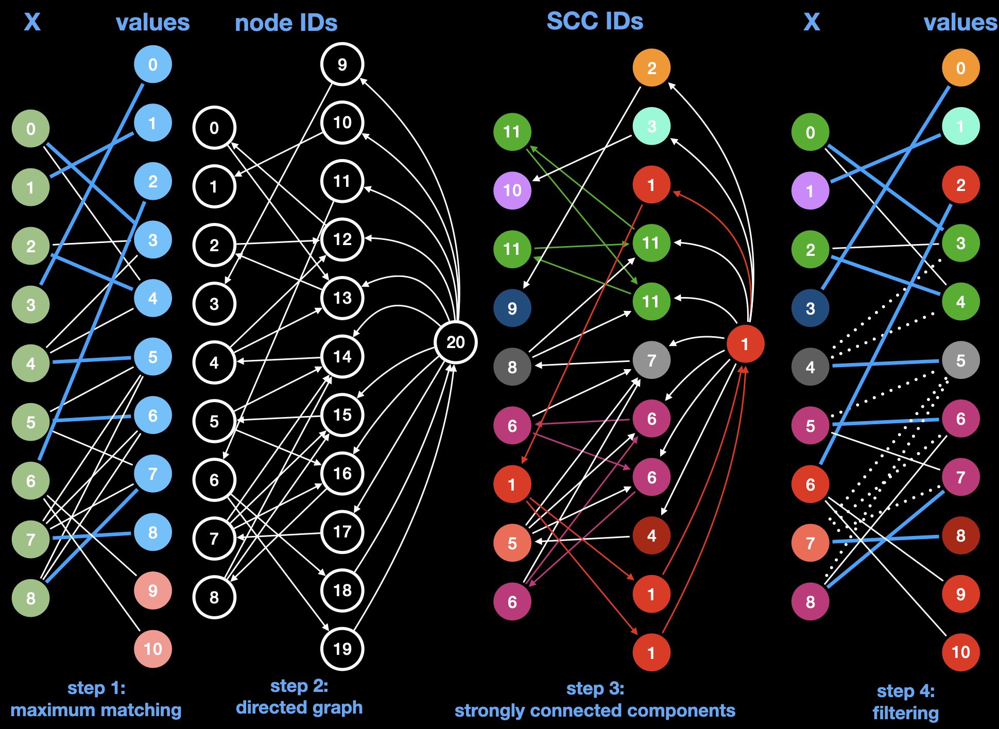

*****************************************************************
Part 6: AllDifferent Constraint
*****************************************************************

*We ask you not to publish your solutions on a public repository.
The instructors interested to get the source code of
our solutions can contact us.*

Slides
======

* `Lectures on Youtube <https://youtube.com/playlist?list=PLq6RpCDkJMyrExrxGKIuE5QixGhoMugKw>`_

* `AllDifferent Constraint <https://www.icloud.com/keynote/030ZtbfaBFg3ZtSs8f2U_H_Yg#06-alldifferent>`_

Theoretical Questions
=====================

* `AllDifferent <https://inginious.org/course/minicp/alldifferent>`_

Forward-Checking Filtering
=========================================

Implement a dedicated propagator `AllDifferentFWC.java <https://github.com/minicp/minicp/blob/master/src/main/java/minicp/engine/constraints/AllDifferentFWC.java>`_
for the global AllDifferent constraint.
Unlike `AllDifferentBinary.java
<https://github.com/minicp/minicp/blob/master/src/main/java/minicp/engine/constraints/AllDifferentBinary.java>`_,
it must not decompose the AllDifferent constraint by posting binary disequality
constraints but instead do the following: when a variable becomes fixed, its value is removed from the domains of all the other variables.
This achieves the same filtering as `AllDifferentBinary.java`,
namely what is called forward-checking consistency.
Avoid iteration over already fixed variables when removing a value:
implement the sparse-set technique, as in `Sum.java
<https://github.com/minicp/minicp/blob/master/src/main/java/minicp/engine/constraints/Sum.java>`_.
Test your implementation in `AllDifferentFWCTest.java <https://github.com/minicp/minicp/blob/master/src/test/java/minicp/engine/constraints/AllDifferentFWCTest.java>`_.
Modify `NQueens.java
<https://github.com/minicp/minicp/blob/master/src/main/java/minicp/examples/NQueens.java>`_
by using `AllDifferentFWC.java` and experiment with the 15-queens instance:
how much speed-up do you observe for finding all the solutions?

Domain-Consistent Filtering
===================================

The objective is to implement the filtering algorithm described in [Regin94]_
to remove every impossible value for the `AllDifferent` constraint (this is called generalized arc consistency and is also known as domain consistency).

Implement the constraint `AllDifferentDC.java <https://github.com/minicp/minicp/blob/master/src/main/java/minicp/engine/constraints/AllDifferentDC.java>`_.

Régin's algorithm is a four-step procedure that can be described with the following figure:

The four steps are:

1. Computing an initial maximum matching in the variable-value graph for the consistency test (matched edges and value
   nodes are colored blue in the figure).
2. Building a directed graph: each matched edge becomes a directed arc to the variable node from the
   value node, and each unmatched edge becomes a directed arc to the value node from the
   variable node. Additionally, a dummy node is added
   that has an incoming arc from each unmatched value node, and an outgoing arc to each matched value node.
3. Computing the strongly connected components (SCCs). Note that for this step, the number of each node in the figure
   corresponds to their SCC rather than their index or value for variable and value nodes respectively.
4. Any arc that was not a matched edge and that connects two nodes from different components is
   removed. Note that for this step the number of each node in the figure once again corresponds to their index or value
   for variable and value nodes respectively.

The two main algorithmic building blocks are provided:

* `MaximumMatching.java <https://github.com/minicp/minicp/blob/master/src/main/java/minicp/engine/constraints/MaximumMatching.java>`_
  is a class that computes a maximum matching given an array of variables. Instantiate this class once in the constructor
  of `AllDifferentDC` and then call `compute` in the `propagate` method.
* `GraphUtil.java <https://github.com/minicp/minicp/blob/master/src/main/java/minicp/util/GraphUtil.java>`_
  contains a static method with signature `public static int[] stronglyConnectedComponents(Graph graph)` to compute the strongly connected
  components. The returned array gives for each node its connected component id.

One of the main difficulties of this exercise is to implement the `Graph` interface
to represent the residual graph of the maximum matching:

.. code-block:: java

    public static interface Graph {
        /* the number of nodes in this graph */
        int n();

        /* incoming nodes ids incident to node idx */
        Iterable<Integer> in(int idx);

        /* outgoing nodes ids incident to node idx */
        Iterable<Integer> out(int idx);
    }

It uses an adjacency list that is updated in the method `updateGraph()`.
We advise you to use a dense representation with node ids as illustrated on the black nodes of the example (step2: directed graph).

Verify that  your implementation passes the tests of `AllDifferentDCTest.java. <https://github.com/minicp/minicp/blob/master/src/test/java/minicp/engine/constraints/AllDifferentDCTest.java>`_.

Once your implementation passes the tests, you can experiment on all previously seen models that make use of the `AllDifferent` constraint (n-Queens, TSP, QAP, etc), 
by replacing each usage of the binary decomposition constraint with this one. Is there a big difference in the number of nodes in the search trees?

.. [Regin94] Régin, J.-C. (1994). A filtering algorithm for constraints of difference in CSPs. 12th National Conference on Artificial Intelligence (AAAI-94). (`PDF <https://aaai.org/Papers/AAAI/1994/AAAI94-055.pdf>`_)
