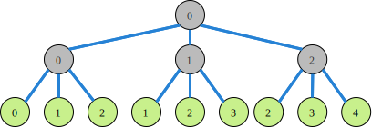

*****************************************************************
Part 8: Search
*****************************************************************

*We ask you not to publish your solutions on a public repository.
The instructors interested to get the source code of
our solutions can contact us.*

Slides
======

* `Lectures on Youtube <https://youtube.com/playlist?list=PLq6RpCDkJMyrT4PlngDv0hQz_4JDgjto4>`_

* `Search Heuristics <https://www.icloud.com/keynote/034UvpcU5ODHMNWkgxYgGU1Kg#08-black-box-search>`_

Theoretical Questions
=====================

* `Search <https://inginious.org/course/minicp/search>`_

Conflict-based Search Strategies
=================================================================

Implement the Last Conflict [LC2009]_ and Conflict Ordering Search [COS2015]_ heuristics.

In MiniCP, a conflict is when when an inconsistency occurs during search. 
The last conflicting variable is the most recent variable that was branched on. 
In MiniCP, when an inconsistency occurs, an `InconsistencyException` is thrown and needs to be caught during branching by the conflict search heuristic.

Test your implementations in `LastConflictSearchTest.java <https://github.com/minicp/minicp/blob/master/src/test/java/minicp/search/LastConflictSearchTest.java>`_
and `ConflictOrderingSearchTest.java. <https://github.com/minicp/minicp/blob/master/src/test/java/minicp/search/ConflictOrderingSearchTest.java>`_.

.. [LC2009] Lecoutre, C., Saïs, L., Tabary, S., & Vidal, V. (2009). Reasoning from last conflict(s) in constraint programming. Artificial Intelligence, 173(18), 1592-1614. (`PDF <https://doi.org/10.1016/j.artint.2009.09.002>`_)

.. [COS2015] Gay, S., Hartert, R., Lecoutre, C., & Schaus, P. (2015). Conflict ordering search for scheduling problems. International Conference on Principles and Practice of Constraint Programming, pp. 140-148. Springer. (`PDF <https://doi.org/10.1007/978-3-319-23219-5_10>`_)

Bound-Impact Value Selector
=================================================================

Implement the bound-impact value selector [BIVS2017]_ in order to discover good solutions quickly.

Implement within `TSPBoundImpact.java <https://github.com/minicp/minicp/blob/master/src/main/java/minicp/examples/TSPBoundImpact.java>`_.
Verify experimentally that the first solution found is smaller than with the default minimum-value heuristic.
You can also use it in combination with your conflict ordering search.

**Hint**: You can test the effect on the objective value by:

1. saving the state, 
2. fixing the selected variable to a value with the `equal` constraint, 
3. retrieving the new domain of the objective variable, and finally
4. restoring the previous state.

Don't forget to catch any `InconsistencyException` that might occur.

.. [BIVS2017] Fages, J.-G., & Prud'Homme, C. (2017). Making the first solution good! IEEE 29th International Conference on Tools with Artificial Intelligence. IEEE. (`PDF <https://doi.org/10.1109/ICTAI.2017.00164>`_)

Limited Discrepancy Search (optional)
=================================================================

Implement `LimitedDiscrepancyBranching`, a branching that can wrap any branching to limit the discrepancy of the branching.

The following figure depicts a search tree where the number of each node is the discrepancy of that node:

Verify that your implementation passes the tests of `LimitedDiscrepancyBranchingTest.java. <https://github.com/minicp/minicp/blob/master/src/test/java/minicp/search/LimitedDiscrepancyBranchingTest.java>`_.
